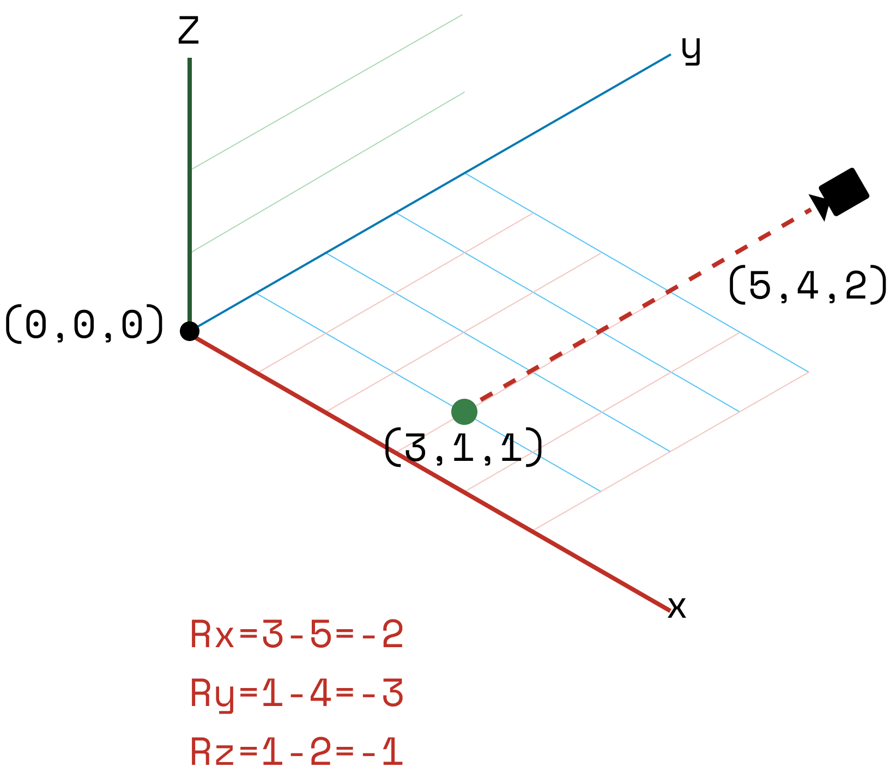

# Summary
Viam's orientation vector is a method for describing the orientation of an object in 3d space.
It is part of a Pose which also includes the position in 3d space.

# Basics
Orientation vectors are composted of 4 attributes.

- RX, RY, RZ - define a vector from the center of the object to another point in the reference frame. This defines the direction something is pointing in.
- Theta - describes the rotation around that vector

# Examples
## Configuring frame for a camera
- You have a room with a camera.
- The corner of the room is (0,0,0)
 -One wants to configure the camera into the frame system, so you need to know where in the room the camera is, and where it's pointing.
- This requires a Pose
- X, Y, Z are simple the measurements from the corner of the room.
- Now to figure out the orientation vector
    - To figure out RX, RY, and RZ first take a picture with the camera
    - Determine the point in the very center of the image
    - Measure the X, Y, Z of that point from the corner (call that X2, Y2, Z2)
    - RX, RY, and RZ become the difference between X,Y,Z and X2, Y2, Z2 and that point's position
    - Theta is measured by looking at the picture and changing until down is correct, likely 0, 90 or 180.
        - To do this, take a picture
        - Determine if the orientation is correct
        - If not, add 90 to Theta, and try again

# Why we like it
- Easy to measure in the real world
- No protractor needed
- Rotation is pulled out (As theta) which is often used independently and measured independently.

